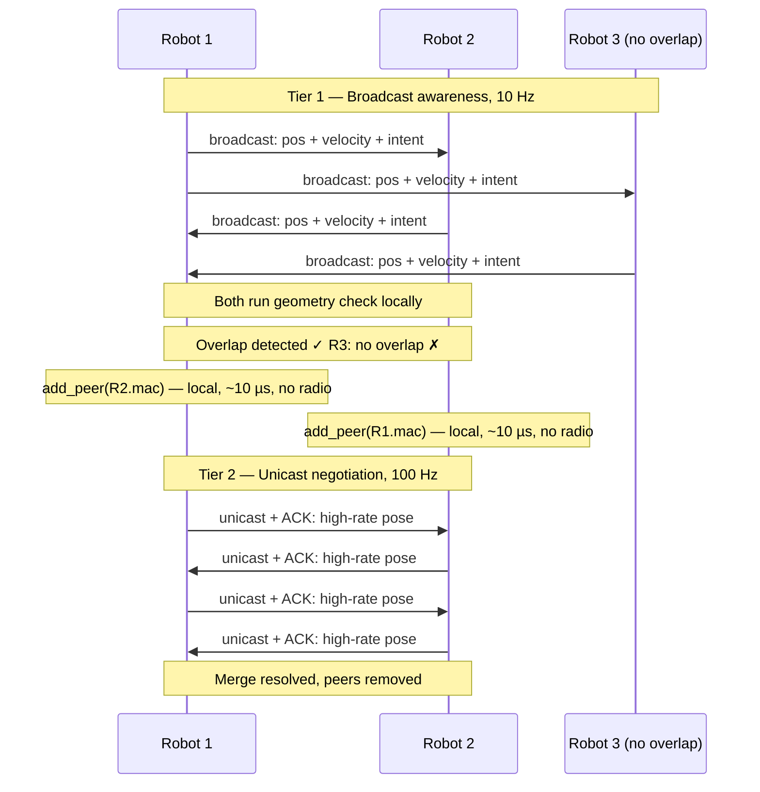

# Swarm Robot Communication — Architecture

## Product Description

This firmware runs on an ESP32-C5 mounted on each robot in a swarm. Each robot continuously broadcasts its position, velocity, and intent to nearby robots over ESP-NOW (Espressif's low-latency peer-to-peer wireless protocol built on top of the WiFi radio).

The primary use case is **merge conflict resolution at speed** — robots travelling at up to 5 m/s in dense environments need to detect approaching robots, assess whether paths overlap, and negotiate right-of-way before a conflict occurs. The system must work with up to 50 robots in the same area.

---

## Two-Tier Communication Architecture

A single approach — broadcast-only or unicast-only — does not satisfy both the scale and reliability requirements:

- **Broadcast** reaches everyone instantly with no registration overhead, but has no delivery guarantee and saturates quickly at high frequency across 50 robots.
- **Unicast** gives reliable ACK-confirmed delivery but requires prior peer registration and is capped at 20 registered peers.

The solution is to use both, for different purposes.

### Tier 1 — Broadcast (Awareness)

- **Frequency:** ~10 Hz
- **Audience:** every robot on the channel — no registration needed
- **Payload:** position, velocity vector, heading, intent
- **Purpose:** maintain situational awareness of all robots in range

Every robot listens to every broadcast. Each robot independently runs a local geometry check against each received broadcast: *"does this robot's projected path intersect mine within the next N seconds?"* No coordination required for this decision.

### Tier 2 — Unicast (Negotiation)

- **Frequency:** ~100 Hz
- **Audience:** only the specific robot(s) whose path overlaps
- **Delivery:** ACK-confirmed, retried on failure
- **Purpose:** high-rate, reliable pose exchange for active conflict resolution

Triggered by the local geometry check. Both robots independently register each other as peers (a local operation, no radio exchange) and begin high-frequency unicast immediately.

---

## Sequence Diagram

---

## Why This Handles the Dense Environment

In a 50-robot environment:

- All 50 robots broadcast at 10 Hz → 500 packets/sec → ~50% channel utilisation (workable)
- At any moment only 3–5 robots are in close proximity → only 3–5 unicast sessions active
- The 20-peer limit is not a constraint in practice

The broadcast tier provides full awareness across all 50 robots at low cost. The unicast tier provides reliability only where it is actually needed.

---

## Rate vs Range Reference

Lower data rates use simpler modulation and can be decoded at weaker signal, giving longer range. The trade-off is more air time per packet.

### 2.4 GHz (recommended for outdoor use)

| Rate | Modulation | Approx. open-air range |
|---|---|---|
| 1 Mbps (CCK) | DBPSK | 300–500 m |
| 11 Mbps | CCK | 150–250 m |
| 6 Mbps OFDM | BPSK 1/2 | 200–300 m |
| 54 Mbps OFDM | 64-QAM 3/4 | 50–100 m |
| MCS0 LGI | BPSK 1/2 | 150–250 m |
| MCS7 LGI | 64-QAM 5/6 | 50–100 m |

### 5 GHz (current — channel 40)

5 GHz has ~6 dB more path loss than 2.4 GHz at the same distance, roughly halving range.

| Rate | Approx. open-air range |
|---|---|
| MCS0 LGI | 80–130 m |
| MCS7 LGI | **25–50 m** ← current setting |

### Long-Range Mode (ESP-LR)

The `RateLora250k` / `RateLora500k` variants in `WifiPhyRate` are Espressif's proprietary long-range WiFi mode — **not** LoRa hardware. Uses spread spectrum at 2.4 GHz and can reach ~1 km open air. Requires both ends to use the same mode. Worth evaluating for the broadcast tier if range is critical.

### Recommendation for This Use Case

At 5 m/s you need detection at 30–50 m minimum. **MCS7 on 5 GHz (current) gives 25–50 m** — right at the edge. Switching to **MCS0–2 on 2.4 GHz** gives 150–250 m range with comfortable headroom for reaction time.

> These are open-air estimates. Measure empirically in your actual environment before committing to a band and rate.

---

## Channel Saturation

At ~1 ms per packet on air:

| Robots broadcasting | Frequency | Packets/sec | Channel load |
|---|---|---|---|
| 10 | 100 Hz | 1000 | saturated |
| 50 | 10 Hz | 500 | ~50 % |
| 50 | 5 Hz | 250 | ~25 % |

For the broadcast tier with 50 robots, **10 Hz is the practical upper bound**. If the environment is consistently dense, 5 Hz leaves headroom for unicast traffic.
